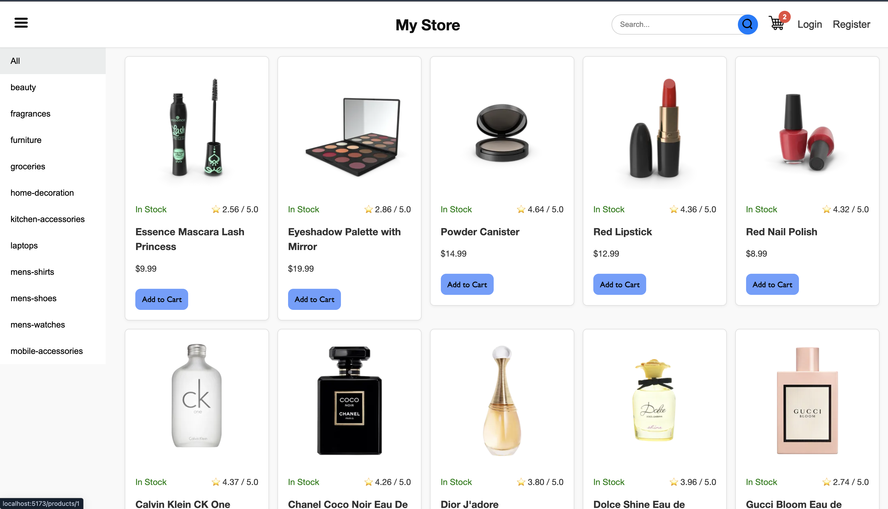
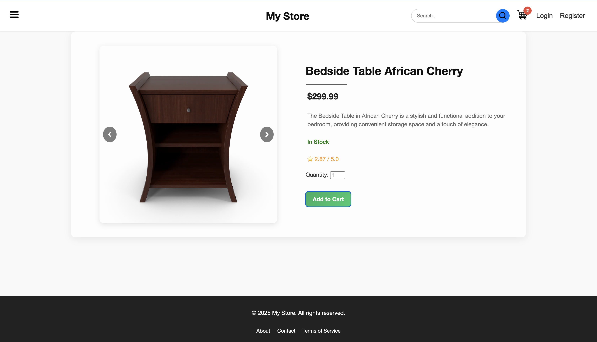
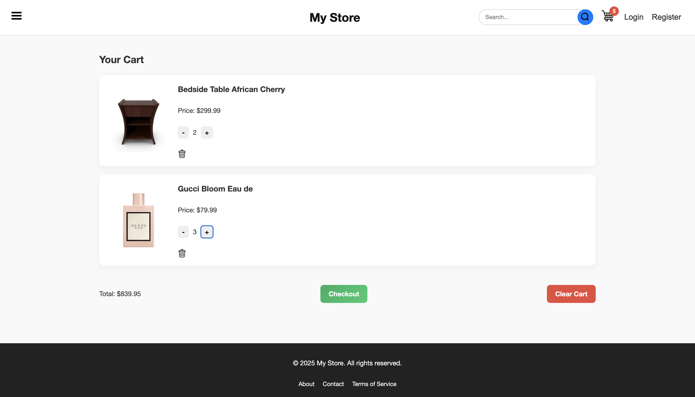
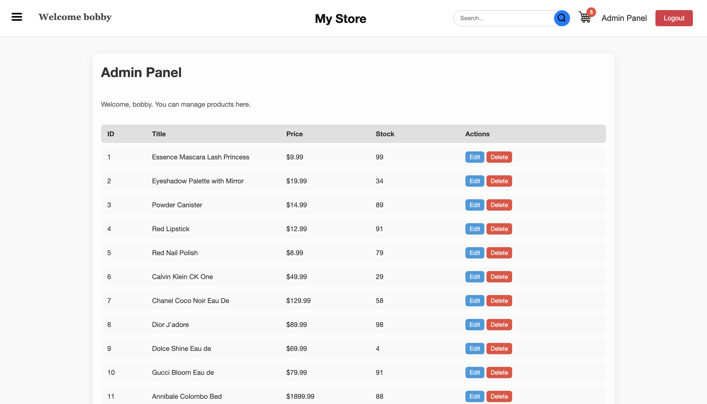

# 🛒 Online Store

[](https://reactjs.org/)  
[](https://nodejs.org/)  
[](https://expressjs.com/)  
[](https://www.mysql.com/)  

A **fullstack e-commerce web app** built with **React, Node.js, Express, and MySQL**.  
Users can browse products, search or filter by category, add items to a cart, and authenticate via login/signup. Admins can manage products with a protected dashboard.

---

## 📌 Table of Contents

1. [Features](#-features)  
2. [Tech Stack](#-tech-stack)  
3. [Project Structure](#-project-structure)  
4. [Installation & Setup](#-installation--setup)  
5. [API Endpoints](#-api-endpoints)  
6. [Screenshots](#-screenshots)  
7. [Live Demo](#-live-demo)  
8. [Future Improvements](#-future-improvements)  
9. [Author](#-author)  

---

## 🚀 Features

### General
- Browse all products with **pagination**
- Filter products by **category** or search by **name**
- **Responsive design** for desktop and mobile
- Protected admin routes

### User Features
- Signup / Login / Logout  
- **Shopping Cart**:
  - Add products with quantity selection  
  - Update quantity  
  - Remove items  
  - Clear cart  
  - Checkout placeholder (alert message)  
- Persistent sessions via **localStorage**

### Admin Features
- Admin dashboard accessible only by users with `admin` role  
- **Update & delete products**

### Product Details
- Image slider for multiple product images  
- Title, price, description, stock status, and rating  
- Quantity selector with validation  
- Add to cart directly from product page  

### Navigation
- **Category sidebar & drawer menu** for easy filtering  
- Navbar shows cart item count, search bar, and auth links  

---

## 🛠️ Tech Stack

**Frontend:** React, React Router, Context API, Axios, CSS  
**Backend:** Node.js, Express.js, JWT Authentication, Bcrypt  
**Database:** MySQL  
**Dev Tools:** Nodemon, Vite, Concurrently  

---

## 📂 Project Structure

### Frontend (`frontend/src`)
```

api/
└─ productApi.js
└─ userApi.js
components/
└─ Navbar.jsx
└─ Footer.jsx
└─ ProductCard.jsx
└─ Pagination.jsx
└─ CategorySidebarMenu.jsx
└─ CategoryDrawerMenu.jsx
└─ ProtectedRoute.jsx
context/
└─ AuthContext.jsx
└─ CartContext.jsx
pages/
└─ Home.jsx
└─ ProductDetails.jsx
└─ Login.jsx
└─ Register.jsx
└─ Cart.jsx
└─ AdminDashboard.jsx
styles/
└─ componentStyles/
     └─ ...
└─ pageStyles/
     └─ ...
└─ App.css/
App.jsx
main.jsx
index.css

```

### Backend (`backend/`)
```
config/
└─ config.js
└─ seedProducts.js

controllers/
└─ productControllers.js
└─ userControllers.js

middleware/
└─ auth.js

routes/
└─ productRoutes.js
└─ userRoutes.js

services/
└─ productServices.js
└─ userServices.js

app.js
server.js

````

---

## 💾 Installation & Setup

### Prerequisites
- Node.js & npm  
- MySQL

### Backend
```bash
cd backend
npm install
````

Create `.env` file:

```
DB_HOST=localhost
DB_USER=root
DB_PASSWORD=yourpassword
DB_NAME=online_store
JWT_SECRET=your_jwt_secret
```

Start backend server:

```bash
npm run dev
```

### Frontend

```bash
cd frontend
npm install
npm run dev
```

Visit the site at `http://localhost:5173` (or Vite’s default port).

---

## 🌐 API Endpoints

### Users

* `POST /api/users/register` → Register new user
* `POST /api/users/login` → Login
* (Future: Admin-only user management)

### Products

* `GET /api/products` → All products
* `GET /api/products/:id` → Single product
* `GET /api/products/categories` → All categories
* `GET /api/products/category/:name` → Products by category
* `PUT /api/products/:id` → Update product (admin only)
* `DELETE /api/products/:id` → Delete product (admin only)

---

## 📸 Screenshots

**Home Page**


**Product Details**


**Cart Page**


**Admin Dashboard**


---

## 🌍 Live Demo

👉 /Comming Soon...

---

## ⚡ Future Improvements

* Full **checkout & payment integration**
* Admin **add product** feature
* Product **sorting & filtering by price or rating**
* User **profile management** (update info, avatar)
* Enhanced **UI error handling & loading animations**

---

## 💻 Author

Harut Choloyan
[GitHub](https://github.com/HarutC05)

